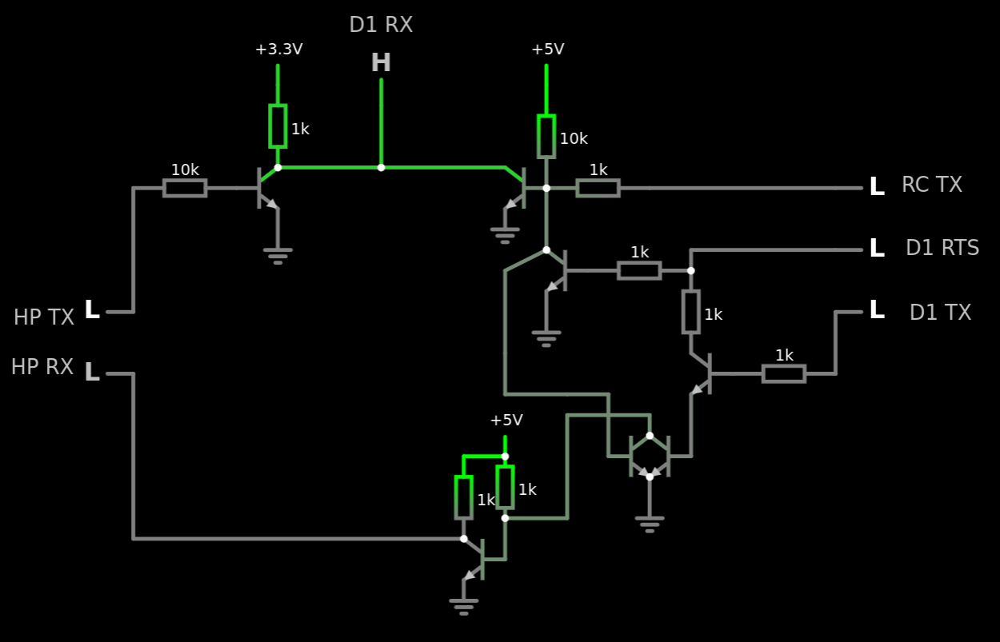
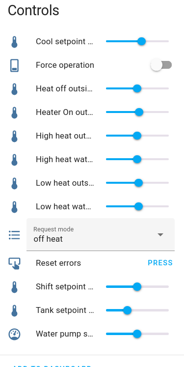
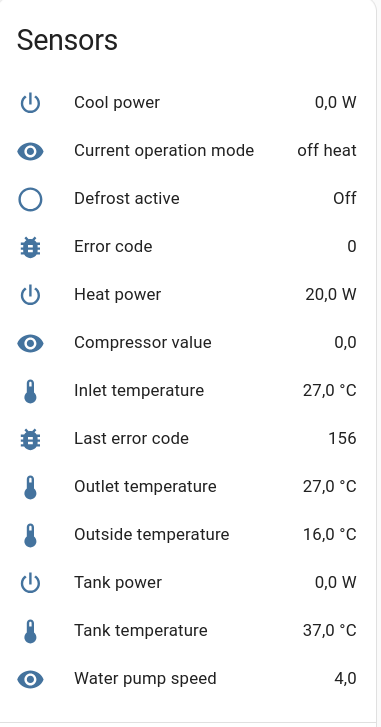

# Description
This project allows for controlling Aquarea F-series heat pumps directly from Home Assistant via standard ESPHome controls.
For it to function, special hardware is needed, which you will have to place between the remote control and the heat pump.
Thanks to this device, you are able to monitor heat pump states and issue your own commands.

```
  Heatpump RX ------|---|---/---------TX  REMOTE
           TX ------|   |   |         RX
            |       |   |   |         |
            |      RX  TX  RTS        |
            |      D1_Mini            |
            |-------------------------|
```
Device consists of brige PCB and D1 mini.


I used hardware serial on pins D8/D7 and one pin for RTS from D1 Mini ESP board. In a 'normal' situation, the D1 Mini only listens to communication between the remote and the heat pump, so you can have entity updates.
When you want to issue a state change from Home Assistant, RTS is set, blocking communication from the remote to the heat pump. The D1 Mini then sends the command and waits for confirmation.
After sending commands, it returns to the 'normal' state.


# How to use
Follow normal ESPHome steps
```bash
docker pull ghcr.io/esphome/esphome
docker run --rm -v "${PWD}":/config -it ghcr.io/esphome/esphome compile aquarea.yaml
docker run --rm -v "${PWD}":/config -it ghcr.io/esphome/esphome run aquarea.yaml
```

# Home assistant entites




# Thank you
Many thanks for work done by<br>
https://github.com/v-s-c-o-p-e/geisha_aquarea_panasonic_arduino_esp8266_proxy
https://github.com/pemue-git/pcb/tree/master/WH-MDC05F3E5_comm

## Disclaimer of Liability

THIS SOFTWARE IS PROVIDED "AS IS", WITHOUT WARRANTY OF ANY KIND, EXPRESS OR IMPLIED, INCLUDING BUT NOT LIMITED TO THE WARRANTIES OF MERCHANTABILITY, FITNESS FOR A PARTICULAR PURPOSE AND NONINFRINGEMENT. IN NO EVENT SHALL THE AUTHORS OR COPYRIGHT HOLDERS BE LIABLE FOR ANY CLAIM, DAMAGES OR OTHER LIABILITY, WHETHER IN AN ACTION OF CONTRACT, TORT OR OTHERWISE, ARISING FROM, OUT OF OR IN CONNECTION WITH THE SOFTWARE OR THE USE OR OTHER DEALINGS IN THE SOFTWARE.

You are solely responsible for any damage to your property, data, or third-party devices that results from the use or misuse of this software. By using this software, you agree to assume all risks associated with its use.
